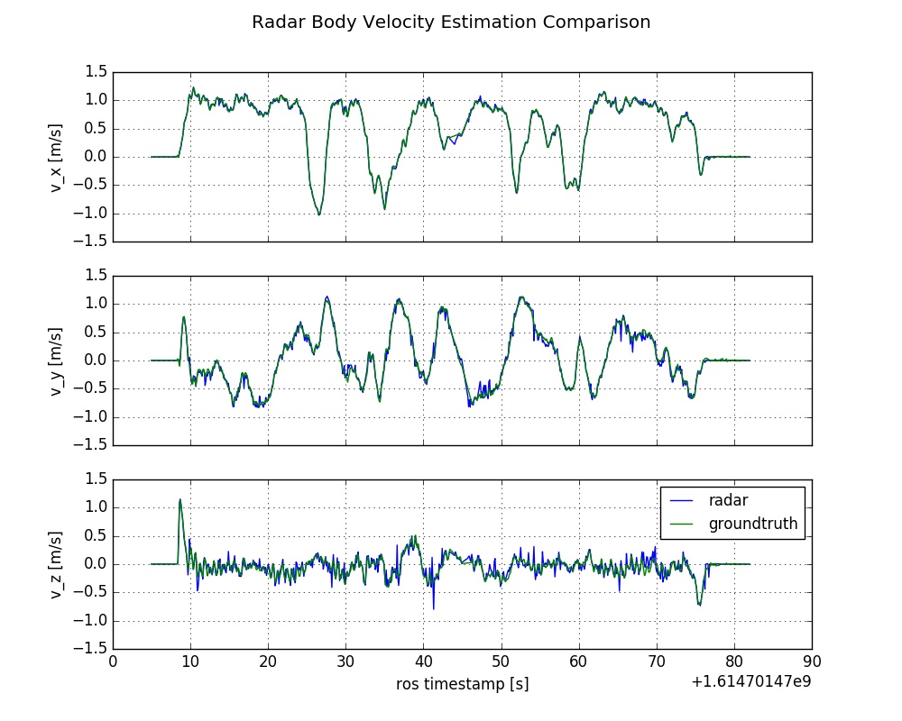
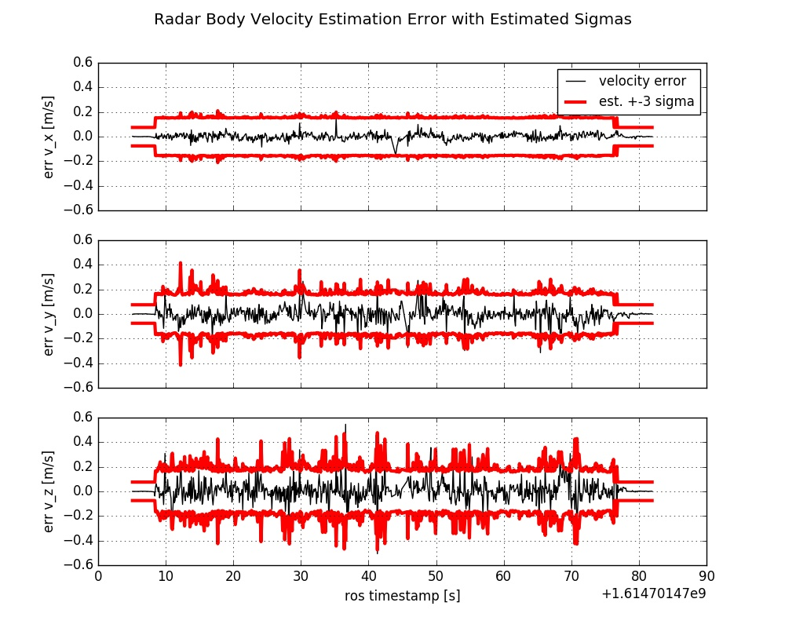

# REVE - Radar Ego Velocity Estimator

REVE - Radar Ego Velocity Estimator is an efficient C++ implementation for ego velocity estimation using radar scans. Such scans (=3D point cloud) can be
measured using modern mmWave radar sensors. Allows for robust and accurate ego velocity estimation even in challenging conditions (darkness, fog, smoke) as radar is not
affected by such conditions!

### Highlights

- Robust and accurate 3D radar ego velocity estimation
- Estimation in the radar frame or a body frame defined by an IMU
- Supports the [rio](https://github.com/christopherdoer/rio) and the ti_mmwave_rospkg point cloud format
- Radar trigger signals can be used for better synchronization
- Super fast: <0.25ms processing time per radar scan

The 3D radar ego velocity is estimated with a 3-Point RANSAC Least Squares approach. It requires a single radar scan (=3D point cloud) only making use of the
direction and Doppler velocity of each detected object. Thus, no scan matching is required resulting in robust velocity estimation even with high dynamics or
difficult scenes with many reflections. In addition, the variances of the resulting 3D ego velocity are estimated as well enabling subsequent fusion. This
approach was evaluated in indoor and outdoor environments for low and high dynamic motion achieving very accurate motion estimation as shown in the demo result.
This package provides also a node which estimates the body frame velocity defined by an IMU using the measured angular velocity and extrinsic calibration (body
frame to radar frame transform).

## Cite

If you use REVE for your academic research, please cite our related paper:

~~~[bibtex]
@INPROCEEDINGS{DoerMFI2020, 
  author={Doer, Christopher and Trommer, Gert F.},
  booktitle={2020 IEEE International Conference on Multisensor Fusion and Integration for Intelligent Systems (MFI)}, 
  title={An EKF Based Approach to Radar Inertial Odometry}, 
  year={2020},
  pages={152-159},
  doi={10.1109/MFI49285.2020.9235254}}
~~~

## Demo Result

The demo dataset [demo_rio_format](demo_datasets/demo_rio_format.bag) is a low dynamic dataset featuring radar scans and ground truth for the body velocity.
Mean runtime to process a single radar scan on an Intel NUC i7-8650U is just 0.15 milliseconds.

### Radar Ego Velocity Estimation
Estimation of the radar ego velocity expressed in the radar coordinate frame.

### Radar Body Velocity Estimation
Estimation of the body frame velocity v_b defined by an IMU. 
The radar ego velocity is transformed into the body frame using rigid body motion making use of the extrinsic transform of the radar sensor.
This includes the translation and rotational part and has to be initially calibrated e.g. using [rio](https://github.com/christopherdoer/rio).
The resulting v_b can be used for further fusion using e.g. a Kalman filter.

Error analysis of the body-frame velocity in [m/s]:

- Mean error: 0.002, -0.002, 0.006
- Mean absolute error: 0.018, 0.039, 0.053
- Mean error norm: 0.078
- STD: 0.027, 0.058, 0.083

## Run the Demos

Run the radar ego velocity demo launch file and generate the upper plot shown above:

~~~[shell]
roslaunch radar_ego_velocity_estimator demo_rio_ego_velocity.launch mode:=rosbag
~~~

Run the body velocity demo launch file with evaluation generating the two lower plots:

~~~[shell]
roslaunch radar_ego_velocity_estimator demo_rio_body_velocity.launch mode:=rosbag
~~~

Run the body velocity estimation in online mode:

~~~[shell]
roslaunch radar_ego_velocity_estimator demo_rio_body_velocity.launch mode:=ros
rosbag play --clock demo_rio_format.bag
~~~

Run the radar ego velocity ti_mmwave_rospkg demo:

~~~[shell]
roslaunch radar_ego_velocity_estimator demo_ti_mmwave_ego_velocity.launch mode:=rosbag
~~~

Run the body velocity ti_mmwave_rospkg demo:

~~~[shell]
roslaunch radar_ego_velocity_estimator demo_ti_mmwave_body_velocity.launch mode:=rosbag
~~~

## Getting Started

Our implementation depends on:

- Ubuntu 16.04 and ROS Kinetic
- [catkin_simple](https://github.com/catkin/catkin_simple.git)
- [catkin_tools](https://catkin-tools.readthedocs.io/en/latest/) (for convenience)

**Build in Release is highly recommended**:

~~~[shell]
catkin build radar_ego_velocity_estimator --cmake-args -DCMAKE_BUILD_TYPE=Release
~~~

## ROS Nodes
The radar_ego_velocity_estimator_ros node is a ros interface for pure radar ego velocity estimation.
The radar_body_velocity_estimator_ros node is a ros interface for the body velocity estimation.
Both nodes can operate in two modes:
- ros-mode: All topics are read using subscriber
- rosbag-mode: A given rosbag in processed at maximum processing speed

Configuration is done using dynamic reconfigure and can be adapted online using rqt_reconfigure.
Check out the default parameter file [here](./radar_ego_velocity_estimator/cfg/cfg_radar_ego_velocity_estimation/radar_ego_velocity_estimator.py).

## License
The source code is released under the [GPLv3](http://www.gnu.org/licenses/) license.